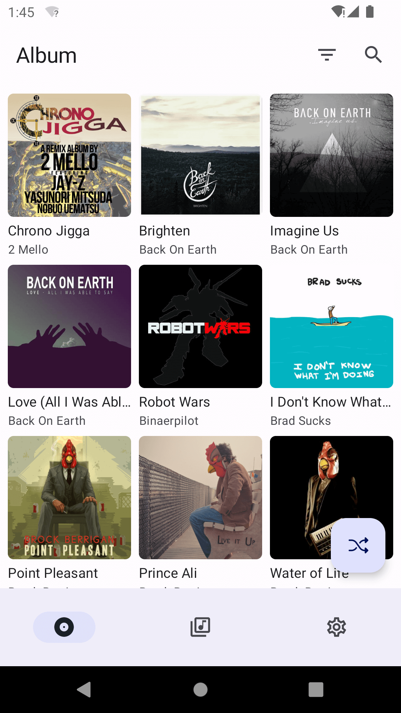
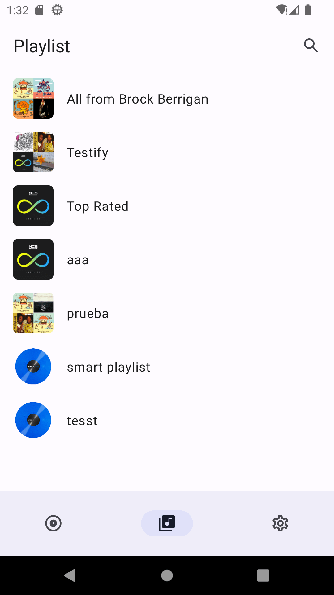
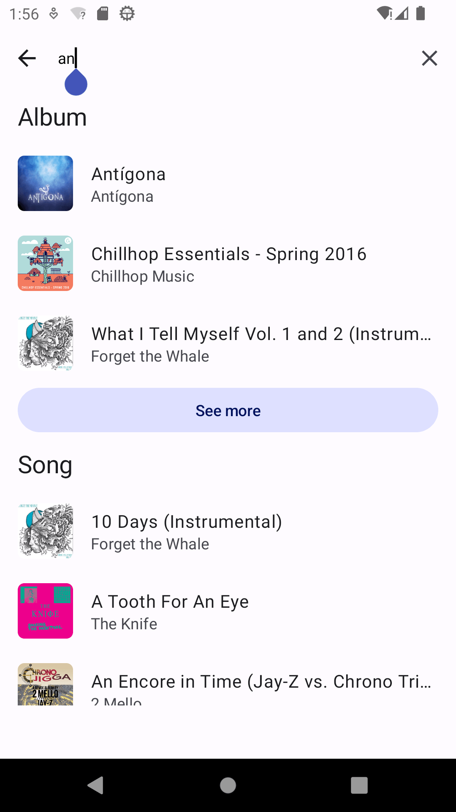
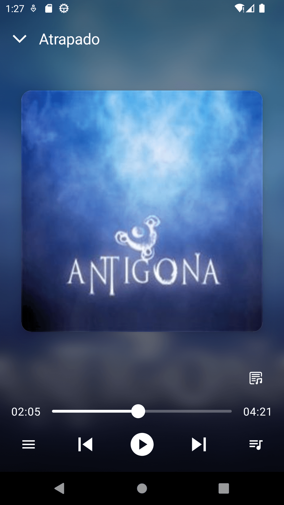

<div align="center">


# 🎵 SubTune

### Cliente Android moderno para servidores Subsonic 🚀

<p align="center">
  SubTune es una aplicación de streaming musical open source para Android, diseñada para conectarse con servidores compatibles con la API de <b>Subsonic</b>, ofreciendo una experiencia moderna, rápida y elegante.
</p>

<p align="center">
  
  
  
  
  
  
</p>

<p align="center">
  <a href="#-preview">Preview</a> •
  <a href="#-características">Características</a> •
  <a href="#-tecnologías-utilizadas">Tecnologías</a> •
  <a href="#-instalación">Instalación</a> •
  <a href="#-roadmap">Roadmap</a>
</p>

</div>

---

# 🌊 Acerca de SubTune

**SubTune** es un cliente Android de streaming musical desarrollado para servidores compatibles con la API de Subsonic (v1.13.0 o superior).

La aplicación permite conectarse a plataformas como:

- 🎵 Subsonic
- ☁️ Navidrome
- 🎧 Airsonic
- 🌐 Otros servidores compatibles

SubTune ofrece una experiencia moderna basada en Material 3, con reproducción multimedia, búsqueda avanzada, playlists y compatibilidad con bibliotecas musicales personales.

---

# 📸 Preview

<div align="center">






</div>

---

# ✨ Características

# 🎧 Streaming Musical

- ▶️ Reproducción de música online
- ⏯️ Controles multimedia
- 🎵 Streaming desde servidores Subsonic
- 🔊 Audio optimizado
- 📍 Control de bitrate máximo

---

# 📂 Biblioteca Musical

- 💿 Navegación de álbumes
- 📜 Gestión de playlists
- 🔍 Búsqueda de canciones
- 🎤 Exploración de artistas
- 🎶 Biblioteca personalizada

---

# 🎨 Experiencia Moderna

- ✨ Material 3 Design
- 🌙 Dark Theme
- 🎨 Dynamic Colors
- 📱 Responsive UI
- ⚡ Navegación fluida

---

# 📝 Funciones Multimedia

- ✍️ Letras sincronizadas
- 🔀 Reproducción aleatoria
- 🎧 Playback avanzado
- 📡 Streaming remoto
- 💾 Gestión multimedia eficiente

---


# 🛠️ Tecnologías Utilizadas

## 📱 Desarrollo Android

<p>
  
</p>

- Kotlin
- Android SDK
- Material 3
- Jetpack Components

---

## 🎵 Multimedia

- Subsonic API
- Audio Streaming
- Media Playback APIs
- Lyrics Support

---

## 🎨 UI & UX

- Material You
- Dynamic Theming
- Dark Mode
- Responsive Components

---

## ☁️ Compatibilidad Servidores

- Subsonic
- Navidrome
- Airsonic
- API Compatible Servers

---

## 🧰 Herramientas

<p>
  
</p>

- Git & GitHub
- Gradle
- Android Studio

---

# 📂 Estructura del Proyecto

```bash
SubTune/
│
├── app/
│   ├── ui/                 # Interfaces y pantallas
│   ├── playback/           # Reproductor multimedia
│   ├── api/                # Conexión Subsonic API
│   ├── models/             # Modelos de datos
│   ├── repository/         # Gestión de información
│   └── utils/              # Utilidades
│
├── screenshots/            # Capturas de pantalla
└── README.md
```

---

# ⚡ Instalación

## 1️⃣ Clonar el repositorio

```bash
git clone https://github.com/ProgramadoresDeTodoUnPoco/AppMovilStreaminMusica.git
cd ProgramadoresDeTodoUnPoco/AppMovilStreaminMusica
```

---

# 🔥 Requisitos

- Android Studio
- JDK 17+
- Android 8+
- Servidor compatible con Subsonic API

---

# ▶️ Ejecutar Proyecto

## Abrir en Android Studio

Seleccionar:

```bash
app
```

---

## Compilar aplicación

```bash
./gradlew assembleDebug
```

---

## Ejecutar en dispositivo

```bash
Run ▶️
```

---

# 🌐 Compatibilidad API

SubTune funciona con servidores compatibles con:

```bash
Subsonic API v1.13.0+
```

Ejemplos:

- Subsonic
- Navidrome
- Airsonic
- Otros compatibles

---

# 🚀 Funcionalidades Completadas

## ✅ Implementado

- 🎵 Streaming online
- 📜 Playlists
- 🔍 Búsqueda avanzada
- 🌙 Dark Mode
- 🎨 Dynamic Colors
- ✍️ Letras sincronizadas
- 🔀 Reproducción aleatoria
- 📡 Compatibilidad Subsonic

---

# 📊 Roadmap

## 🚧 Próximamente

- ❤️ Favoritos inteligentes
- ☁️ Caché offline
- 📱 Android Auto
- 🎶 Ecualizador avanzado
- 🎼 Letras sincronizadas en tiempo real
- 🤖 Recomendaciones inteligentes
- 📡 Chromecast support

---

# 🤝 Contribuciones

Las contribuciones son bienvenidas ❤️

## Pasos para contribuir

1. Haz Fork del proyecto
2. Crea una rama

```bash
git checkout -b feature/nueva-funcion
```

3. Realiza tus cambios
4. Haz commit

```bash
git commit -m "✨ Nueva funcionalidad"
```

5. Haz push

```bash
git push origin feature/nueva-funcion
```

6. Abre un Pull Request 🚀

---

# 👨‍💻 Autor

<div align="center">


## Isai Reyes

Desarrollador Full Stack apasionado por aplicaciones multimedia, Android y plataformas de streaming.

</div>

---

# 🌟 Apoya el Proyecto

Si te gusta SubTune:

⭐ Dale una estrella al repositorio  
🍴 Haz Fork del proyecto  
📢 Compártelo con otros desarrolladores

---

# 📜 Licencia

Este proyecto está bajo la licencia **Apache 2.0**.

---

# ⚠️ Disclaimer

> SubTune es un cliente multimedia open source compatible con servidores Subsonic.
> El contenido reproducido pertenece a sus respectivos propietarios.

---

<div align="center">

### 🎶 SubTune — Tu música, tu servidor, tu experiencia.

</div>
